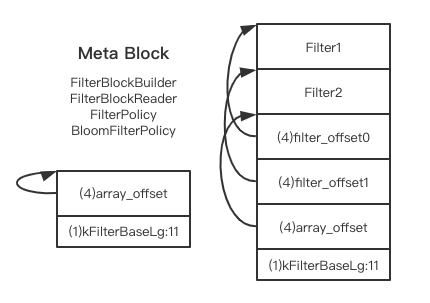

# LevelDB-handbook

## Architecture
### LSM-Tree
The core storage architecture of LevelDB is a log-structured merge tree (LSM), It is optimized for large sequential writes as opposed to small random writes.

### Components
- log
- memtable
- immutable memtable
- sstable

## SSTable: Sorted String Table

